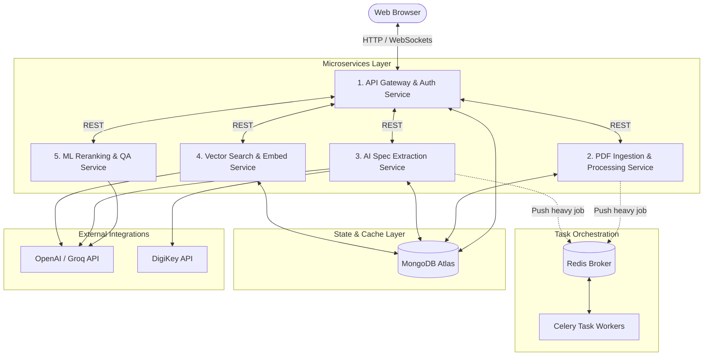

# HPE-TEAM-6: Microservices Deployment & Decoupling Guide

This guide details how to transition the **HPE-TEAM-6 Datasheet Parsing and Component Comparison** system from a monolithic FastAPI web application into a decoupled, highly scalable, and production-ready microservices architecture. 

---

## 🏛️ Monolith vs. Microservices Architecture

### Why Decouple?
1. **Heterogeneous Resource Demands**: The `sentence-transformers` Cross-Encoder model (used for RAG reranking) requires PyTorch and is CPU/GPU intensive. In contrast, the API Gateway and Similarity Calculator are lightweight and I/O-bound.
2. **Scalability**: Scaling heavy AI speculative extraction (staged GPT-4o loops) horizontally without replicating the entire web server and session manager.
3. **Fault Isolation**: Large PDF uploads or malformed documents crashing the parser will not affect active user chat sessions or authentication.
4. **Independent Deployment**: Update UI elements or change embedding strategies without redeploying the extraction engines.

### Proposed Microservices Architecture
The decoupled system partitions the codebase into **five distinct microservices** communicating via HTTP REST APIs (or gRPC) and coordinates state through **MongoDB Atlas** and an optional **Redis Message Broker** for asynchronous task processing.



---

## 📦 Microservices Breakdown

| Service Name | Primary Responsibilities | Python Source Files | Resource Profile | Port |
| :--- | :--- | :--- | :--- | :--- |
| **1. Web API & Gateway** | Session management, User auth, UI hosting, fast mathematical similarity ranking (`rank_components`). | `app.py` (partial), `core/similarity.py`, `static/*` | Low CPU / High Concurrency | `8000` |
| **2. PDF Parser Service** | PDF parsing, chunking, extracting page text/tables, rendering pages to Base64 for Vision analysis. | `core/pdf_processor.py` (partial) | Medium CPU / High Memory | `8001` |
| **3. Spec Extractor Service** | Staged spec extraction orchestrator, DigiKey competitor fetcher, prompt assembly. | `core/extractor.py` (partial), `core/prompts.py` | Low CPU / Bound by API rate limits | `8002` |
| **4. Vector & RAG Service** | Vectorization of chunks, storing/managing vector indexes in MongoDB Atlas. | `core/database.py` (partial) | Low CPU / Network I/O | `8003` |
| **5. ML Reranker Service** | Cross-encoder semantic search reranking, query reformulation, QA synthesis. | `core/extractor.py` (Reranking/QA logic) | High CPU or GPU (PyTorch dependent) | `8004` |

---

## 🐳 Containerization Strategy (Dockerfiles)

To implement this, we dockerize each component using specialized base images to minimize container footprints and load times.

### 1. Web API & Gateway Service
* **Base Image**: `python:3.11-slim`
* **Dockerfile**:
```dockerfile
# gateway.Dockerfile
FROM python:3.11-slim

WORKDIR /app

# Prevent python from writing pyc files and buffering stdout/stderr
ENV PYTHONDONTWRITEBYTECODE=1
ENV PYTHONUNBUFFERED=1

# Install system dependencies
RUN apt-get update && apt-get install -y --no-install-recommends \
    build-essential \
    && rm -rf /var/lib/apt/lists/*

COPY requirements.txt .
# Filter requirements to exclude heavy ML frameworks like PyTorch / sentence-transformers
RUN sed -i '/sentence-transformers/d' requirements.txt && \
    pip install --no-cache-dir -r requirements.txt

COPY ./core/similarity.py ./core/
COPY ./core/database.py ./core/
COPY ./static ./static
COPY ./app.py .

EXPOSE 8000

# Run with Gunicorn/Uvicorn for production-grade concurrency
CMD ["uvicorn", "app:app", "--host", "0.0.0.0", "--port", "8000", "--workers", "4"]
```

### 2. PDF Ingestion & Processing Service
* **Base Image**: `python:3.11-slim`
* **Dockerfile**:
```dockerfile
# pdf_parser.Dockerfile
FROM python:3.11-slim

WORKDIR /app

ENV PYTHONDONTWRITEBYTECODE=1
ENV PYTHONUNBUFFERED=1

# Install OS libraries for PyMuPDF / pdfplumber
RUN apt-get update && apt-get install -y --no-install-recommends \
    libmupdf-dev \
    gcc \
    && rm -rf /var/lib/apt/lists/*

COPY requirements.txt .
# Exclude ML packages
RUN sed -i '/sentence-transformers/d' requirements.txt && \
    pip install --no-cache-dir -r requirements.txt

# Copy only code related to PDF parsing
COPY ./core/pdf_processor.py ./core/
COPY ./core/database.py ./core/
# Simple wrapper API entrypoint
COPY ./services/pdf_parser_app.py ./app.py

EXPOSE 8001

CMD ["uvicorn", "app:app", "--host", "0.0.0.0", "--port", "8001"]
```

### 3. AI Spec Extractor Service
* **Base Image**: `python:3.11-slim`
* **Dockerfile**:
```dockerfile
# spec_extractor.Dockerfile
FROM python:3.11-slim

WORKDIR /app

ENV PYTHONDONTWRITEBYTECODE=1
ENV PYTHONUNBUFFERED=1

COPY requirements.txt .
RUN sed -i '/sentence-transformers/d' requirements.txt && \
    pip install --no-cache-dir -r requirements.txt

COPY ./core/extractor.py ./core/
COPY ./core/prompts.py ./core/
COPY ./core/database.py ./core/
COPY ./services/spec_extractor_app.py ./app.py

EXPOSE 8002

CMD ["uvicorn", "app:app", "--host", "0.0.0.0", "--port", "8002"]
```

### 4. Vector & RAG Service
* **Base Image**: `python:3.11-slim`
* **Dockerfile**:
```dockerfile
# rag_service.Dockerfile
FROM python:3.11-slim

WORKDIR /app

ENV PYTHONDONTWRITEBYTECODE=1
ENV PYTHONUNBUFFERED=1

COPY requirements.txt .
RUN sed -i '/sentence-transformers/d' requirements.txt && \
    pip install --no-cache-dir -r requirements.txt

COPY ./core/database.py ./core/
COPY ./services/rag_app.py ./app.py

EXPOSE 8003

CMD ["uvicorn", "app:app", "--host", "0.0.0.0", "--port", "8003"]
```

### 5. ML Reranker Service (CPU / GPU Optimized)
* **Base Image**: `pytorch/pytorch:2.1.2-cuda12.1-cudnn8-runtime` (if GPU is available) or `python:3.11-slim` (for CPU only deployment).
* **Dockerfile**:
```dockerfile
# reranker.Dockerfile
FROM python:3.11-slim

WORKDIR /app

ENV PYTHONDONTWRITEBYTECODE=1
ENV PYTHONUNBUFFERED=1
# Download model directory cache path
ENV TORCH_HOME=/app/model_cache
ENV HF_HOME=/app/model_cache

RUN apt-get update && apt-get install -y --no-install-recommends \
    build-essential \
    && rm -rf /var/lib/apt/lists/*

COPY requirements.txt .
# Install full requirements including sentence-transformers
RUN pip install --no-cache-dir -r requirements.txt

# Pre-fetch Cross-Encoder model during build time to speed up cold starts
RUN python -c "from sentence_transformers import CrossEncoder; CrossEncoder('cross-encoder/ms-marco-MiniLM-L-6-v2')"

COPY ./core/extractor.py ./core/
COPY ./services/reranker_app.py ./app.py

EXPOSE 8004

CMD ["uvicorn", "app:app", "--host", "0.0.0.0", "--port", "8004"]
```

---

## 🛠️ Service Inter-communication APIs

Instead of importing Python modules across services, they communicate via JSON REST payloads. Below are the basic routing endpoints we establish:

### 1. PDF Parser Service (`POST /api/v1/parse`)
* **Request**: Multipart Form-data (`file: PDF`)
* **Response**:
```json
{
  "pdf_hash": "sha256...",
  "page_count": 15,
  "structured_pages": [
    {"page_num": 1, "text": "...", "tables": "..."}
  ]
}
```

### 2. Spec Extractor Service (`POST /api/v1/extract`)
* **Request**:
```json
{
  "pdf_hash": "sha256...",
  "component_type": "LDO Regulator",
  "required_features": ["Operating Temperature", "Output Current"],
  "structured_pages": [...]
}
```
* **Response**: Extracted spec fields mapped to values.

### 3. ML Reranker Service (`POST /api/v1/rerank`)
* **Request**:
```json
{
  "query": "Is the temperature range compliant with automotive standards?",
  "candidate_chunks": [
    {"chunk_id": "...", "text": "..."}
  ],
  "top_k": 5
}
```
* **Response**: Reranked candidates with relevance scores.

---

## 🐳 Local Multi-Container Orchestration (`docker-compose.yml`)

Use this `docker-compose` configuration to start the complete system locally. It maps the host environments, handles networks, and persists MongoDB and Redis cache storage.

```yaml
version: '3.8'

services:
  # 1. API Gateway & Frontend
  gateway:
    build:
      context: .
      dockerfile: gateway.Dockerfile
    ports:
      - "8000:8000"
    environment:
      - MONGO_URI=mongodb://mongodb:27017/datasheet_hpe
      - PDF_PARSER_URL=http://pdf-parser:8001
      - SPEC_EXTRACTOR_URL=http://spec-extractor:8002
      - RAG_SERVICE_URL=http://rag-service:8003
      - RERANKER_URL=http://reranker:8004
      - DIGIKEY_CLIENT_ID=${DIGIKEY_CLIENT_ID}
      - DIGIKEY_CLIENT_SECRET=${DIGIKEY_CLIENT_SECRET}
    depends_on:
      - mongodb
    networks:
      - hpe-net

  # 2. PDF Processor
  pdf-parser:
    build:
      context: .
      dockerfile: pdf_parser.Dockerfile
    volumes:
      - pdf-storage:/app/datasheets
    networks:
      - hpe-net

  # 3. Spec Extractor
  spec-extractor:
    build:
      context: .
      dockerfile: spec_extractor.Dockerfile
    environment:
      - OPENAI_API_KEY=${OPENAI_API_KEY}
      - GROQ_API_KEY=${GROQ_API_KEY}
    networks:
      - hpe-net

  # 4. RAG Service
  rag-service:
    build:
      context: .
      dockerfile: rag_service.Dockerfile
    environment:
      - MONGO_URI=mongodb://mongodb:27017/datasheet_hpe
      - OPENAI_API_KEY=${OPENAI_API_KEY}
    networks:
      - hpe-net

  # 5. ML Reranker (CPU Mode)
  reranker:
    build:
      context: .
      dockerfile: reranker.Dockerfile
    volumes:
      - torch-cache:/app/model_cache
    networks:
      - hpe-net

  # 6. Database (Local Development)
  mongodb:
    image: mongo:6.0
    ports:
      - "27017:27017"
    volumes:
      - mongo-data:/data/db
    networks:
      - hpe-net

networks:
  hpe-net:
    driver: bridge

volumes:
  mongo-data:
  torch-cache:
  pdf-storage:
```

---

## 📈 Decoupling Steps & Code Refactoring Checklist

To successfully transition:
1. **Extract APIs**: Create a `/services` folder. Write a simple FastAPI wrapper (`app.py`) for each of the microservices.
2. **Remove direct module imports**:
   * Replace `core.pdf_processor.parse_pdf_to_structured_pages` inside `extractor.py` and `app.py` with HTTP requests calling the `pdf-parser` microservice.
   * Replace the direct instantiation and usage of `_get_cross_encoder()` inside `core/extractor.py` with HTTP calls routing queries to `http://reranker:8004/api/v1/rerank`.
3. **Externalize Database connections**: Enforce using environment variables (`MONGO_URI`) across all services rather than hardcoded connection profiles inside `core/database.py`.
4. **Decouple PDF Storage**: In a microservice model, files uploaded to the Gateway should not be saved locally to a folder. Instead, use an Object Store (like AWS S3 or MinIO) so both the Gateway, PDF Parser, and Spec Extractor can fetch files via secure presigned URLs.
5. **Implement Celery Async Tasks**:
   * Uploading a datasheet triggers a Celery task `tasks.process_and_embed_pdf.delay(pdf_hash, file_url)`.
   * Gateway returns `202 Accepted` with a task status identifier.
   * UI queries Gateway `/api/task/{task_id}` to check state rather than holding a synchronous connection open for minutes.

---

## 🚀 Cloud Production Deployment Guidelines

For deploying to production environments (e.g. AWS, GCP, Azure):

1. **Database Integration**:
   * Switch the local `mongodb` container with a managed **MongoDB Atlas** database cluster. MongoDB Atlas is required for native Vector Search indexes on the `pdf_chunks` collections.
2. **Kubernetes (EKS / GKE)**:
   * Deploy services as standard Kubernetes deployments and services.
   * Assign a GPU node group for the **Reranker Service** deployment and mount a persistent cache directory to avoid downloading models on pod recycling.
3. **Secret Management**:
   * Do not pass API keys in plain text `.env` files. Use **AWS Secrets Manager** or **HashiCorp Vault** injected as Kubernetes environment secrets.
4. **Auto-scaling**:
   * Configure Horizontal Pod Autoscaling (HPA) using CPU metrics for the **Gateway** and **PDF Parser**.
   * Use custom Prometheus queue length metrics (Celery queue backlog) to scale the **Spec Extractor** and **RAG Service** workers.
