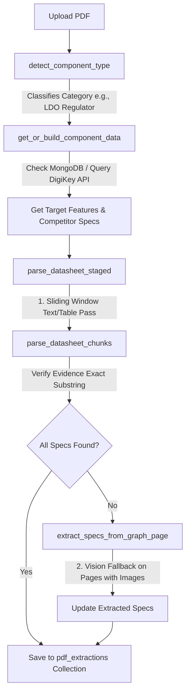
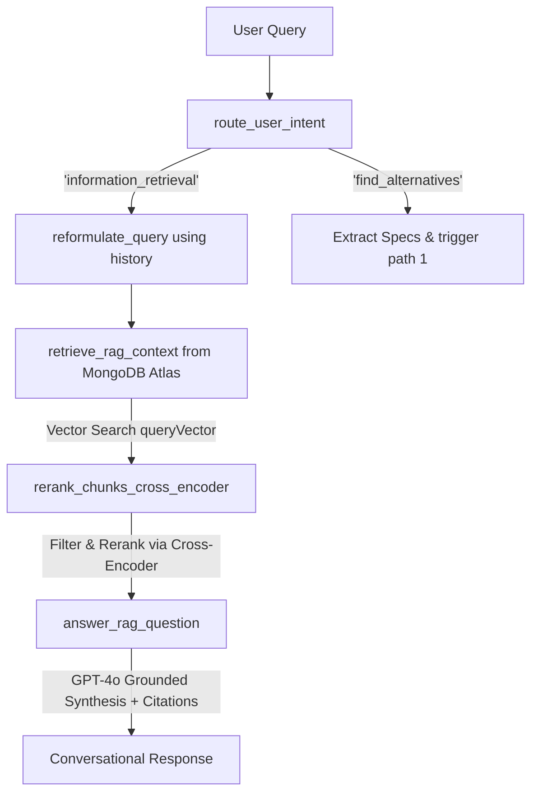
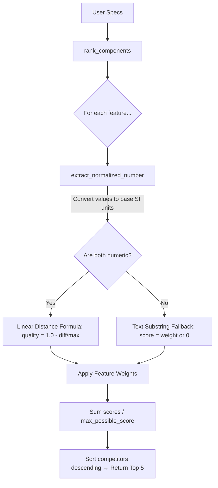

# Project Overview & Architecture Guide

Welcome to the **HPE-TEAM-6** Datasheet Parsing and Component Comparison system. This project is an agentic, RAG-powered pipeline designed to:
1. Parse hardware datasheet PDFs.
2. Automatically classify component types.
3. Extract detailed technical features/specifications using LLMs (with text/table parsing and vision-based fallback).
4. Fetch real-time market competitors and specifications from the DigiKey database.
5. Perform weighted mathematical similarity matching to find and rank the top 5 closest alternative components.
6. Provide an interactive chatbot workspace allowing engineers to ask grounded questions about their datasheets (using vector search and Cross-Encoder reranking).

---

## 📂 Project Directory Structure

```text
HPE-TEAM-6/
│
├── core/                           # System core logic
│   ├── __init__.py                 # Core package initializer
│   ├── database.py                 # MongoDB interface (users, sessions, cache, vectors)
│   ├── extractor.py                # Heavy spec extraction (GPT-4o, vision, cross-encoder RAG)
│   ├── pdf_processor.py            # PDF parsing, image extraction, and chunking
│   ├── prompts.py                  # OpenAI API prompt templates
│   └── similarity.py               # Unit normalization & mathematical matching algorithms
│
├── datasheets/                     # Repository for uploaded component PDF datasheets
│
├── static/                         # Frontend assets
│   └── index.html                  # Single-page dashboard UI (HTML/CSS/JS)
│
├── app.py                          # FastAPI web application entry point
├── run_test.py                     # CLI pipeline testing script
├── test_mongo.py                   # Cache-clearing & database reset utility
├── requirements.txt                # Package dependencies
└── .env                            # API keys and connection strings (Git ignored)
```

---

## ⚙️ Core Pipelines & System Workflows

The system has three primary pipelines operating concurrently:

### 1. Spec Extraction & Market Schema Builder (Staged Extraction)


### 2. Advanced Retrieval-Augmented Generation (RAG) Chat


### 3. Competitor Similarity Matching Engine


---

## 📄 File-by-File Function Guide

---

### 1. `core/prompts.py`
This file acts as a centralized repository for the core LLM prompt templates. It does not contain executable code, only multiline string variables.

| Variable Name | Purpose |
|:---|:---|
| `DYNAMIC_EXTRACTION_PROMPT` | Guides the model in parsing a **single** target feature from page text. Enforces strict JSON return values and exact evidence matching. |
| `BATCH_EXTRACTION_PROMPT` | Guides the model in parsing **multiple** target features simultaneously in a sliding window. Instructs the model on semantic mapping (understanding that different datasheet terms refer to the same DigiKey standard term). |

---

### 2. `core/similarity.py`
This module manages unit normalization and contains the math formulas to rank alternative parts.

| Function / Dictionary | Description | Inputs | Outputs |
|:---|:---|:---|:---|
| `UNIT_MULTIPLIERS` | *Dictionary* mapping physical units (current, voltage, resistance, frequency, power, capacitance, time) to SI base unit multipliers. | N/A | N/A |
| `extract_normalized_number` | Uses regex to strip units, parses the numerical values, and converts them to base units (e.g., `130µA` becomes `0.00013`). Safely differentiates Mega (`M`) and milli (`m`). | `val_str`: str | `float` or `None` |
| `calculate_feature_score` | Computes a similarity score between two values. If both are numbers, it calculates a linear distance percentage drop-off. If categorical/text, it falls back to a substring match. | `user_val_str`: str, `comp_val_str`: str, `weight`: int | `float` (score from `0` to `weight`) |
| `rank_components` | Computes similarity percentages across all features for 20 competitors, applies custom weights, and ranks them. | `user_extracted_specs`: dict, `digikey_competitors`: list, `feature_weights`: dict | `list` of top 5 ranked competitor records |

---

### 3. `core/pdf_processor.py`
This module contains the libraries and helper functions to extract text, tables, and page visuals from PDF files.

| Function | Description | Inputs | Outputs |
|:---|:---|:---|:---|
| `_normalize_detected_type` | Standardizes raw/user categorizations into unified category names (e.g., matching "angular rate" to "Gyroscope"). | `raw_type`: str, `available_types`: list, `early_text`: str | `str` (Normalized category) |
| `_extract_early_pdf_text` | Resiliently parses the first two pages of a PDF to fetch introductory text for category detection. Uses `pdfplumber` with a `PyMuPDF` fallback. | `pdf_path`: str, `max_pages`: int | `str` (Extracted text) |
| `detect_component_type` | Feeds the first 4000 characters of a PDF to GPT-4o to automatically detect the component's category. | `pdf_path`: str, `available_types`: list | `str` (Detected component category) |
| `parse_pdf_to_structured_pages` | Converts a PDF into an in-memory list of page dictionaries containing clean paragraph text and formatted markdown-style table grids. | `filepath`: str | `list` of structured page objects |
| `pdf_hash` | Generates a SHA-256 hash of a file's binary content to create unique identifiers for caching. | `filepath`: str | `str` (Hex SHA-256) |
| `parse_pdf_chunk_to_structured_pages` | Reads and extracts structured data from a specific page range of a PDF. Used to stream pages efficiently. | `filepath`: str, `start_page`: int, `end_page`: int | `tuple`: (structured pages list, total pages count) |
| `get_figure_pages` | Uses PyMuPDF to find page indices containing embedded images/drawings. | `filepath`: str, `start_page`: int, `end_page`: int | `list` of 1-indexed page numbers |
| `render_page_to_base64` | Renders a PDF page to a PNG bitmap image and encodes it to base64 for LLM Vision parsing. | `filepath`: str, `page_num_1indexed`: int, `dpi`: int | `str` (Base64 string) |
| `retrieve_feature_context` | Scans structured pages for keyword references to a feature. Boosts page scores if keywords match inside table elements, returning the top pages as a RAG context block. | `structured_pages`: list, `feature_name`: str, `top_k`: int | `str` (Concentrated text context) |
| `process_pdf_for_rag` | Generates granular chunks of text paragraphs and tables with metadata for database indexing. | `filepath`: str, `filename`: str | `list` of chunk dictionaries |

---

### 4. `core/database.py`
This module manages connections to MongoDB and operations on various collections.

| Function | Description | Inputs | Outputs |
|:---|:---|:---|:---|
| `_get_db` | Establishes or retrieves the MongoDB client connection to the `datasheet_hpe` database. | None | `Database` connection |
| `_hash_password` | Helper function to hash user passwords using SHA-256. | `password`: str | `str` (Password hash) |
| `register_user` | Creates a new user credential record in the database if the username does not exist. | `username`, `password` | `tuple`: (success status, message) |
| `login_user` | Validates username and hashed password credentials. | `username`, `password` | `tuple`: (user ID, message) |
| `add_user_pdf` | Records that a PDF hash belongs to a user's library and saves upload metadata. | `user_id`, `pdf_hash`, `filename` | None |
| `get_user_pdfs` | Retrieves a list of PDF metadata uploaded by a user, sorted chronologically. | `user_id` | `list` of PDF records |
| `get_user_pdf_hashes` | Fetches a list of all PDF hashes that belong to a specific user. | `user_id` | `list` of strings |
| `create_chat_session` | Initializes an empty session workspace for conversational QA. | `user_id`: str, `session_name`: str | `str` (session ID) |
| `get_user_sessions` | Retrieves a user's chat sessions, prioritizing pinned sessions. | `user_id`: str | `list` of session objects |
| `attach_pdf_to_session` | Associates a specific PDF to a chat session workspace. | `session_id`: str, `pdf_hash`: str | `bool` (Success status) |
| `get_session_data` | Pulls the messages and configurations for a workspace session. | `session_id`: str | `dict` or `None` |
| `save_session_messages` | Appends new message logs (user/assistant) to a session's history. | `session_id`: str, `new_messages`: list | None |
| `delete_chat_session` | Deletes a chat session workspace. | `session_id`: str | `bool` |
| `rename_chat_session` | Modifies the custom label of a session workspace. | `session_id`: str, `new_name`: str | `bool` |
| `toggle_pin_session` | Flips the pin status of a session. | `session_id`: str | `bool` |
| `get_cached_pdf_extraction` | Retrieves cached PDF specs using its SHA-256 hash. | `pdf_sha256`: str | `dict` or `None` |
| `save_pdf_extraction` | Caches a PDF's detected category and specs. | `pdf_sha256`, `filename`, `detected_type`, `extracted_specs` | None |
| `get_digikey_token_lazy` | Fetches a fresh DigiKey OAuth2 access token on demand. | None | `str` (OAuth token) |
| `get_or_build_component_data` | **Core DigiKey Engine:** Pulls dynamic component properties and 20 competitors. Hits the cache first; on miss, calls DigiKey Search API, parses properties, extracts schemas, and stores in MongoDB. | `component_type`: str | `tuple`: (features list, competitors list) |
| `has_rag_chunks` | Checks if a PDF has already been chunked and vectorized. | `pdf_sha256`: str | `bool` |
| `store_rag_chunks` | Computes embeddings via OpenAI `text-embedding-3-small` in batches and saves them to the `pdf_chunks` collection. | `chunks`: list, `pdf_sha256`: str | None |
| `retrieve_rag_context` | Executes an Atlas Vector Search pipeline. Supports global searches across multiple PDF hashes. | `query`: str, `filename`: str, `pdf_sha256`: str/list, `top_k`: int | `list` of matching text chunks |

---

### 5. `core/extractor.py`
This module acts as the AI orchestrator, coordinating sliding-window parsing, Vision model fallback, intent routing, and conversational response formulation.

| Function | Description | Inputs | Outputs |
|:---|:---|:---|:---|
| `_parse_retry_delay_seconds`| Parses sleep time from OpenAI rate limit strings. | `error_text`: str | `float` (Delay in seconds) |
| `_chat_completion_with_retry`| Invokes the OpenAI Chat API with exponential backoff on transient errors. | `**kwargs` | Chat completion response |
| `normalize_text_for_comparison`| Lowercases and strips whitespaces to make comparisons robust. | `text`: str | `str` |
| `get_full_json_examples` | Formulates example JSON mock competitor lists to feed into prompt variables. | `market_competitors`: list, `sample_size`: int | `str` (Example JSON block) |
| `parse_datasheet_chunks` | Formulates a batch request to GPT-4o to extract specific parameters from a list of page blocks. Compares returned evidence against the source context to prevent hallucination. | `structured_pages`: list, `required_features`: list, `market_competitors`: list, `component_name`: str | `dict` of successfully extracted spec mappings |
| `get_missing_features` | Identifies which specs are currently unresolved. | `extracted_specs`: dict | `list` of missing features |
| `extract_specs_from_graph_page`| Submits a page screenshot to GPT-4o's vision parser to read graphs or charts. | `page_b64`: str, `missing_features`: list, `component_type`: str | `dict` of extracted specs |
| `parse_datasheet_staged` | **Core Staged Extraction Engine:** Slides through a PDF page by page (chunk size 15), calling text extraction. Runs a vision fallback on pages with images for remaining missing features. Stops early if all features are found. | `filepath`, `component_type`, `required_features`, `market_competitors`, `component_name`, `chunk_size` | `dict` (Complete feature-value map) |
| `_get_cross_encoder` | Instantiates or returns the MS-MARCO Cross-Encoder reranker. | None | `CrossEncoder` or `None` |
| `rerank_chunks_cross_encoder`| Re-scores and sorts candidate chunks using semantic relevance, returning the top `top_k` results. | `query`: str, `chunks`: list, `top_k`: int | `list` of reranked chunks |
| `reformulate_query` | Rephrases questions containing pronouns or relative references using context from the chat history. | `query`: str, `chat_history`: list | `str` (Standalone search query) |
| `route_user_intent` | Evaluates user input to determine if they are asking for market alternatives (`find_alternatives`) or trying to analyze the current document (`information_retrieval`). | `query`: str, `chat_history`: list | `str` ('find_alternatives' or 'information_retrieval') |
| `answer_rag_question` | **Core Chat Engine:** Generates grounded answers based on retrieved and reranked context. Appends chunk citations and manages multi-document contexts. | `query`, `retrieved_chunks`, `chat_history`, `is_global` | `str` (Final grounded answer) |

---

### 6. `app.py`
The web server built with FastAPI that exposes REST APIs and serves the frontend dashboard.

#### Key Endpoints & Routes:
- **`GET /`**: Serves the single-page application dashboard (`static/index.html`).
- **`POST /api/register`**: Registers user credentials (username, password).
- **`POST /api/login`**: Authenticates and starts user sessions.
- **`GET /api/user/{user_id}/pdfs`**: Fetches user-uploaded document lists.
- **`GET /api/extraction/{pdf_hash}`**: Retrieves cached specs from database.
- **`POST /api/upload`**: Receives PDFs, links them to users/sessions, and triggers background vectorization for RAG.
- **`POST /api/rank`**: Direct endpoint for calculating similarity rankings using user weights.
- **`POST /api/chat`**: Routes chat messages. If the query asks for alternatives, it runs the staged extraction pipeline and returns interactive sliders. Otherwise, it executes RAG search, reranks, and returns grounded answers.
- **`POST /api/sessions`**: Creates a chat session.
- **`GET /api/user/{user_id}/sessions`**: Lists chat sessions.
- **`POST /api/sessions/attach`**: Attaches a PDF to a session workspace.
- **`POST /api/sessions/save_messages`**: Commits conversation history changes to MongoDB.
- **`GET /api/sessions/{session_id}`**: Retrieves session context, including attached files.
- **`GET /api/datasheets/{filename}`**: Serves a PDF file from local storage.
- **`DELETE /api/sessions/{session_id}`**: Deletes a session workspace.
- **`PATCH /api/sessions/{session_id}/pin`**: Pins/unpins a session.
- **`PATCH /api/sessions/{session_id}/rename`**: Renames a session.
- **`POST /api/pricing`**: Queries DigiKey API for real-time pricing and stock.

---

### 7. `run_test.py`
A testing script to execute the spec extraction and ranking process locally in a terminal environment.

- **`get_user_weights`**: Prompts the developer in the console to input weights (`0-100`) for extracted specs.
- **`main`**: Detects a PDF's type, fetches DigiKey competitor data, parses pages, extracts specs, gathers terminal weights, computes rankings, prints the top 5 matches, and saves results to `final_report.json`.

---

### 8. `test_mongo.py`
A cache-clearing utility script for debugging and resets.

- Connects to MongoDB, clears records for a target PDF from collections, drops dynamic component metadata/schemas, and deletes local FAISS index files (if present).

---

## 🗄️ MongoDB Collections Schema

The system stores its operational and cached data across several collections in the `datasheet_hpe` database:

### 1. `users`
Tracks user credentials.
```javascript
{
  "_id": ObjectId("..."),
  "username": "raihan",
  "password": "hashed_password_string"
}
```

### 2. `user_pdfs`
Links files to users.
```javascript
{
  "_id": ObjectId("..."),
  "user_id": "...",
  "pdf_hash": "sha256_hash...",
  "filename": "ADXRS453.pdf",
  "uploaded_at": "2026-06-17T11:50:00Z"
}
```

### 3. `chat_sessions`
Manages workspaces and chat memory.
```javascript
{
  "_id": ObjectId("..."),
  "session_id": "session_...",
  "user_id": "...",
  "session_name": "My Workspace",
  "attached_pdfs": ["pdf_hash_1", "pdf_hash_2"],
  "messages": [
    { "role": "user", "content": "What is the operating voltage?" },
    { "role": "assistant", "content": "The operating voltage is 3.3V [page_1_text_2]." }
  ],
  "is_pinned": false,
  "created_at": "...",
  "updated_at": "..."
}
```

### 4. `pdf_extractions`
Caches extracted datasheet specifications.
```javascript
{
  "_id": ObjectId("..."),
  "pdf_hash": "sha256_hash...",
  "filename": "ADXRS453.pdf",
  "detected_type": "Gyroscope",
  "specs": {
    "Operating Supply Voltage": "3.3 V",
    "Current - Supply": "6 mA",
    "Operating Temperature": "-40°C ~ 105°C"
  },
  "updated_at": "...",
  "source": "upload_pipeline"
}
```

### 5. `pdf_chunks`
Stores text/table chunks and vector embeddings for RAG searches. Needs a Vector Index named `vector_index` on the `embedding` path.
```javascript
{
  "_id": ObjectId("..."),
  "pdf_hash": "...",
  "chunk_id": "page_1_text_0",
  "filename": "ADXRS453.pdf",
  "page": 1,
  "chunk_type": "text",
  "text": "The ADXRS453 is a high performance angular rate sensor...",
  "embedding": [ 0.0123, -0.0456, ... ], // 1536-dimensional array
  "ingested_at": "..."
}
```

### 6. `feature_schemas`
Caches dynamic parameters and competitor data fetched from DigiKey.
```javascript
{
  "_id": ObjectId("..."),
  "component_type": "Gyroscope",
  "features": ["Operating Supply Voltage", "Current - Supply", ...],
  "competitors": [
    {
      "part_number": "ADXRS453BEYZ",
      "specs": {
        "Operating Supply Voltage": "3.3 V",
        "Current - Supply": "6 mA",
        ...
      }
    },
    ... // Up to 20 competitors
  ],
  "sampled_products": 20,
  "stored_at": "...",
  "source": "digikey_api"
}
```
